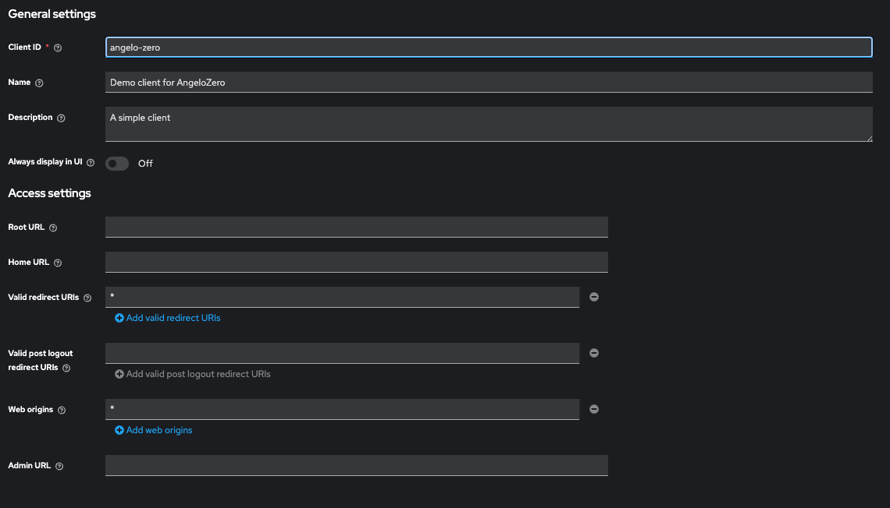
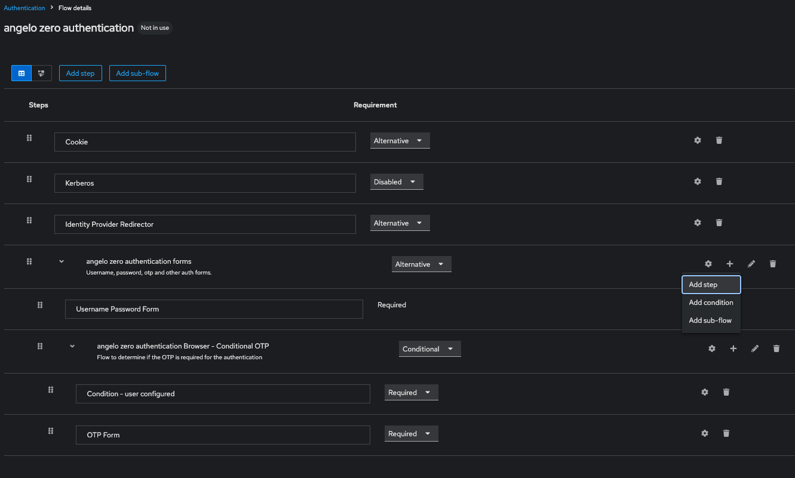
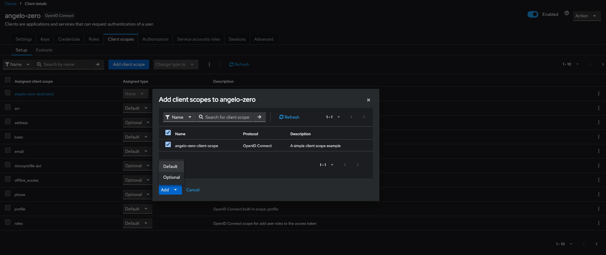

# Keycloack SPI

### Autenticação usando Keycloack, Springboot com JWT, PostgresSQL e Docker


- Neste artigo irei demonstrar como criar uma simples SPI customizada para interceptar uma autenticação. Ao interceptar esta autenticação nós vamos salvar o registro do usuário interceptado em uma base postgres SQL e devolver seu id nos dados do token autenticado. Logo após iremos chamar uma api REST e recuperar este id via token. A idéia é exclusivamente para estudo e não uma solução para um "problema real".

---
## SPI
- O que é um SPI (Service Provider Interface) ? 
  - Uma SPI é um mecanismo que permite a extensão e personalização do comportamento do Keycloak
  - As SPIs fornecem um conjunto de interfaces que os desenvolvedores podem implementar para adicionar novas funcionalidades ou modificar as existentes.

---
### A interface AuthenticatorFactory
- A interface `AuthenticatorFactory` é fundamental para a personalização e extensão dos mecanismos de autenticação no Keycloak, permitindo que desenvolvedores integrem novos métodos de autenticação de forma flexível e configurável.
  - **Criação de Autenticadores**: Permite a criação de instâncias de autenticação que podem ser utilizadas durante o processo de login.
  - **Configuração**: Fornece métodos para definir propriedades e configurações do autenticador.
  ```java
  import org.keycloak.authentication.AuthenticationFlowContext;
  import org.keycloak.authentication.Authenticator;
  import org.keycloak.models.KeycloakSession;
  import org.keycloak.models.RealmModel;
  import org.keycloak.models.UserModel;
  import org.slf4j.Logger;
  import org.slf4j.LoggerFactory;

  public class CustomAuthenticationFactory implements AuthenticatorFactory {
    // some implemented methods here...
  }
  ```

### Sobre os Métodos
- **create(KeycloakSession keycloakSession)**: 
  - Cria e retorna uma instância do `CustomAuthenticator`.

- **getRequirementChoices()**: 
  - Requisitos que define se a autenticação é obrigatória ou desativada.

- **getDisplayType()**: 
  - Nome a ser exibido da autenticação criada.

- **getConfigProperties()**: 
  - Lista de propriedades de configuração para o autenticador.

- **getId()**: 
  - Retorna o identificador do provedor do autenticador personalizado, que é uma constante definida na classe `CustomAuthenticator`.

---
### A interface Authenticator
- A interface `Authenticator` é responsável por gerenciar o processo de autenticação de usuários.
- **Implementação:** Geralmente, a classe Authenticate implementa a interface Authenticator, que define os métodos necessários para o processo de autenticação.
- **Configuração:** A classe deve ser configurada no Keycloak através do console de administração, onde você pode associar a SPI a um fluxo de autenticação específico.
```java
import org.keycloak.authentication.AuthenticationFlowContext;
import org.keycloak.authentication.Authenticator;
import org.keycloak.models.KeycloakSession;
import org.keycloak.models.RealmModel;
import org.keycloak.models.UserModel;
import org.slf4j.Logger;
import org.slf4j.LoggerFactory;

public class CustomAuthenticator implements Authenticator {
    // some implemented methods here...
}
```

### Sobre os Métodos
- **authenticate(AuthenticationFlowContext context):** 
  - Este método é chamado para iniciar o processo de autenticação. Aqui, você pode implementar a lógica para verificar as credenciais do usuário.

- **action(AuthenticationFlowContext context):** 
  - Este método é usado para lidar com ações adicionais durante a autenticação, como a confirmação de uma senha ou a verificação de um código enviado por SMS.

- **setRequiredActions(KeycloakSession keycloakSession, RealmModel realmModel, UserModel userModel):** 
  - Permite definir ações que o usuário deve realizar após a autenticação inicial, como a atualização de senha ou a configuração de autenticação de dois fatores


---
### As interfaces OIDCAccessTokenMapper, OIDCIDTokenMapper e UserInfoTokenMapper 
- A classe estende `AbstractOIDCProtocolMapper` e implementa várias interfaces, incluindo `OIDCAccessTokenMapper`, o que permite mapear atributos personalizados para o token de acesso.
```java
import org.keycloak.models.ClientSessionContext;
import org.keycloak.models.KeycloakSession;
import org.keycloak.models.ProtocolMapperModel;
import org.keycloak.models.UserSessionModel;
import org.keycloak.protocol.oidc.mappers.*;
import org.keycloak.provider.ProviderConfigProperty;
import org.keycloak.representations.IDToken;
import org.slf4j.Logger;
import org.slf4j.LoggerFactory;

public class CustomAccessTokenMapper extends AbstractOIDCProtocolMapper implements OIDCAccessTokenMapper, OIDCIDTokenMapper, UserInfoTokenMapper {
    //some methdos here...
}
```
### Sobre os Métodoa
  - **setClaim(IDToken token, ProtocolMapperModel mappingModel, UserSessionModel userSession, KeycloakSession keycloakSession, ClientSessionContext clientSessionCtx)**
    - A função setClaim é onde o mapeamento real acontece, permitindo que atributos adicionais sejam incluídos no token.

---
### A pasta *META-INF* e seus arquivos
- Para registro do autenticador personalizado no Keycloak, é necessário criar:
    - 1. **`META-INF`**: 
        - Essa pasta é necessária para armazenar os metadados do seu módulo. 
        - É uma convenção em aplicações Java que permite que o Keycloak reconheça e configure seu autenticador personalizado.

    - 2. **`*.AuthenticatorFactory` e `*.ProtocolMapper`**: 
        - Esses arquivos são cruciais, pois eles informam ao Keycloak sobre as interfaces que estão sendo implementandas.
        - Neles, você define as classes que implementam a lógica do seu autenticador e mapeador.

- **Exemplo de Estrutura de Arquivo**
  ```plaintext
  my-custom-authenticator-project/
  │
  ├── META-INF/
  │   └── services/
  │       └── org.keycloak.authentication.AuthenticatorFactory
  │       └── org.keycloak.protocol.ProtocolMapper
  │
  └── CustomAccessTokenMapper.java
  └── CustomAuthenticationFactory.java
  └── CustomAuthenticator.java
  ```


---
## Publicando uma SPI via Docker
  - Execute o comando `mvn clean install` ou `mvn clean package`
  - Acesse a pasta `target` para copiar e colar o .jar para a pasta `providers` do keycloak através do seguinte comando:
  - *( necessário ter o [Docker](https://docs.docker.com/engine/install/) instalado )*
    ```shell
    docker cp keycloak-custom-spi.jar  keycloak_container:/opt/keycloak/providers
    ```
  - Via terminal build o `.jar` com o seguinte comando:
    ```shell
    docker exec -it keycloak_container /opt/keycloak/bin/kc.sh build
    ```
  - Após o build realizado com suceeso reinicie seu container do Keycloack

---  
## Executando o Keycloack
### Keycloack Docker Container
  ```yml
  version: '3.8'

  services:
    postgres:
      image: postgres
      container_name: postgres_container
      networks:
        - keycloak-network
      environment:
        POSTGRES_USER: admin
        POSTGRES_PASSWORD: admin
        POSTGRES_DB: postgres
      ports:
        - "5432:5432"
      platform: linux/amd64

    keycloak:
      image: keycloak/keycloak:25.0.0
      container_name: keycloak_container
      networks:
        - keycloak-network
      environment:
        DB_VENDOR: postgres
        DB_ADDR: postgres
        DB_PORT: 5432
        DB_DATABASE: postgres
        DB_USER: admin
        DB_PASSWORD: admin
        KEYCLOAK_ADMIN: admin
        KEYCLOAK_ADMIN_PASSWORD: admin
  #      use these parameters if your keycloak version is 26.x.x
  #      KC_BOOTSTRAP_ADMIN_USERNAME: admin
  #      KC_BOOTSTRAP_ADMIN_PASSWORD: admin

      ports:
        - "8080:8080"
      platform: linux/amd64
      command: start-dev

  networks:
    keycloak-network:
      driver: bridge
  ```

---
## Configurando o Keycloak
### Executando o Keycloak
- Acesse o Keycloak via [localhost](http://localhost:8080/)
- Crie seu usuário com senha para acesso de administrador
- Logue com o usuário cadastrado
  
- Criando um **Realm**
  
- Criando um **Client**
  
  
  
  
### Configurando e adicionando a SPI 
- **CustomAuthenticator**
  
   
  
  
  
- **CustomAccessTokenMapper**
  
  
  
  
  
  
  

---
## Conectando com uma base [LDAP](https://www.forumsys.com/2022/05/10/online-ldap-test-server/)
- User federation > Add LDAP provider
  - General options
    - **Vendor:** Other
  
  - Connection and authentication settings
    - **Connection URL:** ldap://ldap.forumsys.com:389
    - **Bind DN:** cn=read-only-admin,dc=example,dc=com
    - **Bind credentials:** password

  - LDAP searching and updating
    - **Edit mode:** READ_ONLY
    - **Users DN:** dc=example,dc=com

  
  

---
## Verificando os usuários importados
- Em Users busque pelo usuário "*guass*"
  
  

---
## Buscando as informações de autenticação em Realm
- Realm settings clique no menu [OpenID Endpoint Configuration](http://localhost:8080/realms/angelo-zero-realm/.well-known/openid-configuration)
- Ele irá abrir a seguinte informação
  ```yaml
  {
      "issuer": "http://localhost:8080/realms/angelo-zero-realm",
      // Auth URL
      "authorization_endpoint": "http://localhost:8080/realms/angelo-zero-realm/protocol/openid-connect/auth",
      // Access Token URL
      "token_endpoint": "http://localhost:8080/realms/angelo-zero-realm/protocol/openid-connect/token",
      "introspection_endpoint": "http://localhost:8080/realms/angelo-zero-realm/protocol/openid-connect/token/introspect",
      "userinfo_endpoint": "http://localhost:8080/realms/angelo-zero-realm/protocol/openid-connect/userinfo",
      // some information here...
  }
  ```
- Via postman crie uma nova autenticação 
  

- Recupere os valores de Client ID e Client Secret
  
  

- Get New Access Token
  
  

---
## Validando as SPI
- Através dos log's via container keycloak
  ```shell
  [CustomAuthenticator] - Custom Authenticator SPI
  [CustomAuthenticator] - User request data info:
  [CustomAuthenticator] - USERNAME ---------------> gauss
  [CustomAuthenticator] - PASSWORD ---------------> password
  [CustomAuthenticator] - CLIENT_MASTER_ID -------> 0
  [CustomAuthenticator] - CLIENT_MASTER_ENABLE ---> true
  [UserPostgresRepository] - Find user by email: gauss@ldap.forumsys.com
  [UserPostgresRepository] - Getting connection into PostgresSQl database
  [UserPostgresRepository] - No User was found with email gauss@ldap.forumsys.com
  [UserPostgresRepository] - Getting connection into PostgresSQl database
  [UserPostgresRepository] - User saved with success
  [CustomAuthenticator] - User "gauss" authenticated with success
  [CustomAccessTokenMapper] - Custom Access Token Mapper SPI
  [UserPostgresRepository] - Find user by email: gauss@ldap.forumsys.com
  [UserPostgresRepository] - Getting connection into PostgresSQl database
  [UserPostgresRepository] - User found with success
  [UserPostgresRepository] - ID -------------- 9
  [UserPostgresRepository] - FIRST NAME ------ Carl Friedrich Gauss
  [UserPostgresRepository] - EMAIL ----------- gauss@ldap.forumsys.com
  [CustomAccessTokenMapper] - Token updated with success with "PostgresSQL User ID": "9"
  ```

- E o seguinte token gerado
  ```shell
  eyJhbGciOiJSUzI1NiIsInR5cCIgOiAiSldUIiwia2lkIiA6ICJuT0JxeVpPbkowNGtWb1hhbEVjZ3BxRUJiV25EakQ4Q0ljb2cyenQ1elQ0In0.eyJleHAiOjE3NDUxODMzMzAsImlhdCI6MTc0NTE4MzAzMCwiYXV0aF90aW1lIjoxNzQ1MTgzMDI5LCJqdGkiOiI5MGVjOGNjNS1iOGM3LTRmZTUtYjQ0NS0yMWM1YzZiOTAxZGIiLCJpc3MiOiJodHRwOi8vbG9jYWxob3N0OjgwODAvcmVhbG1zL2FuZ2Vsby16ZXJvLXJlYWxtIiwiYXVkIjoiYWNjb3VudCIsInN1YiI6IjIxMTcwZjBmLTU4ZTktNDFlMC1iYWYyLWU0YzRlN2IxNGI2NyIsInR5cCI6IkJlYXJlciIsImF6cCI6ImFuZ2Vsby16ZXJvIiwic2lkIjoiN2MwMWE3YmYtNDdjNy00NmZhLWFkYjgtZTgyYzhmNmI3NGQ2IiwiYWNyIjoiMSIsImFsbG93ZWQtb3JpZ2lucyI6WyIqIl0sInJlYWxtX2FjY2VzcyI6eyJyb2xlcyI6WyJkZWZhdWx0LXJvbGVzLWFuZ2Vsby16ZXJvLXJlYWxtIiwib2ZmbGluZV9hY2Nlc3MiLCJ1bWFfYXV0aG9yaXphdGlvbiJdfSwicmVzb3VyY2VfYWNjZXNzIjp7ImFjY291bnQiOnsicm9sZXMiOlsibWFuYWdlLWFjY291bnQiLCJtYW5hZ2UtYWNjb3VudC1saW5rcyIsInZpZXctcHJvZmlsZSJdfX0sInNjb3BlIjoiZW1haWwgcHJvZmlsZSIsImVtYWlsX3ZlcmlmaWVkIjpmYWxzZSwicG9zdGdyZXNfc3FsX3VzZXJfaWQiOjksIm5hbWUiOiJDYXJsIEZyaWVkcmljaCBHYXVzcyBHYXVzcyIsInByZWZlcnJlZF91c2VybmFtZSI6ImdhdXNzIiwiZ2l2ZW5fbmFtZSI6IkNhcmwgRnJpZWRyaWNoIEdhdXNzIiwiZmFtaWx5X25hbWUiOiJHYXVzcyIsImVtYWlsIjoiZ2F1c3NAbGRhcC5mb3J1bXN5cy5jb20ifQ.fWHN7-KXDTo3GAvv7v3XY-673WgZj4ZKLOIx31pAxwPcuOaX-XVHmQyRyz-41l-wv8Lm0qQYGq6zOcqj_z1vzYzDfGSznGByB91MR18XvQ3mvlmwro2Iz1f3bH-oJ4xxUk3Q49RKm66rUi31jUo4fBHoG-hFhJG1JMz9yaj3GqKd3XZ07CVN_XKQn26dsh-ZBzZH-i0wh-oqHGTeAMfXxEUfaIETFb5fBSwu2Q5CSNl06hMRNs1X12t68Rfb-PDX2NYWbOCBggpaFR72Bu_oO3UqTRxT42W2l_A1LnC7OthVJd0mVVFPXlrDm4U8Go_n2880CNht8VHAoJM9FfIvcw
  ```

- Ao decodificar o token recebemos a seguinte informação do id do usuário registro na base PostgresSQL
  


xxxxxxxxx

.
---
---
---
- Subir postgresql via docker
  - docker pull postgres --platform=linux/amd64 
  - docker run --platform=linux/amd64 -p 5432:5432 -e POSTGRES_USER=admin -e POSTGRES_PASSWORD=admin postgres

- Para copiar jar e temas
    - docker ps e copiar o nome do container Ex.: keycloak_container
    - (dentro de target) docker cp keycloak-custom-spi.jar  keycloak_container:/opt/keycloak/providers
    - (dentro de jar) docker cp postgresql-42.7.2.jar keycloak_container:/opt/keycloak/providers
    - (terminal) docker exec -it keycloak_container /opt/keycloak/bin/kc.sh build
    - (dentro de themes) docker cp ./login keycloak_container:/opt/keycloak/themes

- Iniciar keycloak e postgres na mesma rede
  - docker network create keycloak-network
  - docker run --platform=linux/amd64 --name postgres_container --network keycloak-network -e POSTGRES_USER=admin -e POSTGRES_PASSWORD=admin -e POSTGRES_DB=postgres -p 5432:5432 -d postgres
  - docker run --platform=linux/amd64 --name keycloak_container --network keycloak-network -e DB_VENDOR=postgres -e DB_ADDR=intelligent_euclid -e DB_PORT=5432 -e DB_DATABASE=postgres -e DB_USER=admin -e DB_PASSWORD=admin -p 8080:8080 -e KC_BOOTSTRAP_ADMIN_USERNAME=admin -e KC_BOOTSTRAP_ADMIN_PASSWORD=admin quay.io/keycloak/keycloak:26.1.4 start-dev

Site
- [Keycloak](https://www.keycloak.org/)
- [Keycloak with Docker](https://www.keycloak.org/getting-started/getting-started-docker)
    - to run on a MacOs Sonoma 14.2.1 Apple M1 add "--platform=linux/amd64"
    - docker run --platform=linux/amd64 -p 8080:8080 -e KC_BOOTSTRAP_ADMIN_USERNAME=admin -e KC_BOOTSTRAP_ADMIN_PASSWORD=admin quay.io/keycloak/keycloak:26.1.4 start-dev
        - solution found by GabaGabaDev on question [Stackoverflow - M1 mac cannot run jboss/keycloak docker image](https://stackoverflow.com/questions/67044893/m1-mac-cannot-run-jboss-keycloak-docker-image)

- [Installation Guide for Keycloak (macOS)](https://blog.devops.dev/installation-guide-for-keycloak-macos-c17a111bfdff)
- [Stackoverflow - Implement custom SPI in Keycloak by Azdy](https://stackoverflow.com/questions/62672377/implement-custom-spi-in-keycloak)
- [Service Provider Interfaces (SPI)](https://www.keycloak.org/docs/latest/server_development/#_providers)


- Next Steps
1 - create a rest application
2 - integration test with custom spi

- Postgres
  - CREATE TABLE "USER" (
    id SERIAL PRIMARY KEY,
    first_name VARCHAR(50) NOT NULL,
    last_name VARCHAR(50) NOT NULL,
    email VARCHAR(100) UNIQUE NOT NULL,
    password VARCHAR(255) NOT NULL
    );
  - 


---
- [Keycloak UserFederation e Mappers - by Marco Seabra](https://www.youtube.com/watch?v=PHbxodkWlxg)
- [How to create a Keycloak client with an audience mapper - by Alex Ellis](https://www.youtube.com/watch?v=G2QVhUAEylc)
- [Custom Protocol Mapper - by Niko Köbler](https://www.youtube.com/watch?v=5WBb176YqKg)
- [Baeldung - Custom Protocol Mapper with Keycloak](https://www.baeldung.com/keycloak-custom-protocol-mapper)
- [GitHub - Keycloak - ScriptBasedOIDCProtocolMapper](https://github.com/keycloak/keycloak/blob/main/services/src/main/java/org/keycloak/protocol/oidc/mappers/ScriptBasedOIDCProtocolMapper.java)